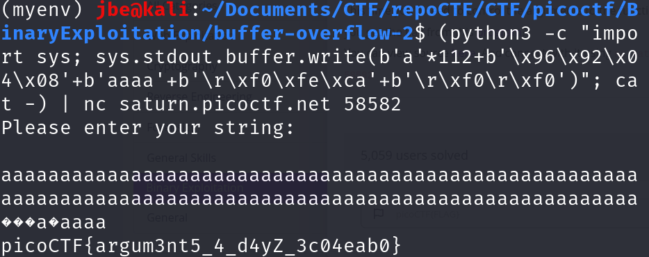

# TITLE : buffer overflow 2
## Author : Sanjay C / Palash Oswal
## Description:
Control the return address and arguments
This time you'll need to control the arguments to the function you return to! Can you get the flag from this [program](https://artifacts.picoctf.net/c/143/vuln)?
You can view source [here](https://artifacts.picoctf.net/c/143/vuln.c). 
## Hints
- Try using GDB to print out the stack once you write to it.
## Solution
In this challenge, our goal is to call the hidden win(arg1, arg2) function—even though it’s never invoked normally—and pass it the two magic values (0xCAFEF00D and 0xF00DF00D) so it prints our flag. This is essentially the same technique used in the “buffer overflow 1” problem.

**Step 1: Locate the argument slots.**  
Using GDB, set a breakpoint at win and run the program. Examine the stack frame with info frame (or simply inspect memory at $ebp+0x8 and $ebp+0xc). You’ll see that:

- `[ebp + 0x8]` holds arg1
- `[ebp + 0xC]` holds arg2

**Step 2: Find the overflow offset.**  
In vuln(), char buf[100] sits on the stack. By overflowing with a known pattern (e.g. "A"*200) and checking eip in GDB, you’ll discover you need 112 bytes of padding to reach the saved return address. 

**Step 3: Craft the payload.**
1. 112 bytes of filler
2. The 4-byte address of win() (little-endian)
3. Four junk bytes (to occupy the old EBP slot)
4. `0xCAFEF00D` (little-endian)
5. `0xF00DF00D` (little-endian)

**Step 4: Try to get the flag.**
.

## Flag
picoCTF{argum3nt5_4_d4yZ_3c04eab0}
