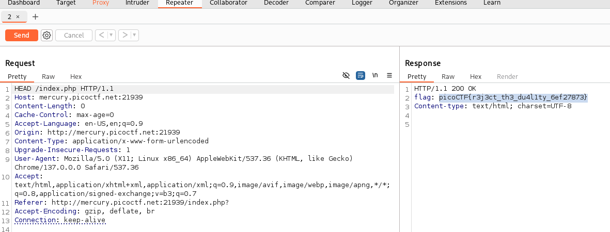

# TITLE : GET aHEAD
## Author : madStacks
## Description : 
Find the flag being held on this server to get ahead of the competition http://mercury.picoctf.net:21939/
## Hints :
- Maybe you have more than 2 choices
- Check out tools like Burpsuite to modify your requests and look at the responses
## Solution 
As the title suggests, we only need to change the HTTP request method to HEAD. To do this, we can use a tool like Burp Suite.

In Burp Suite, enable the Proxy and turn on Intercept, then interact with the web page (e.g., by clicking the red or blue button). Once the request is captured, send it to the Repeater. In the Repeater tab, change the request method from GET (or POST) to HEAD, and then send the modified request.

You should receive a response that contains the flag

